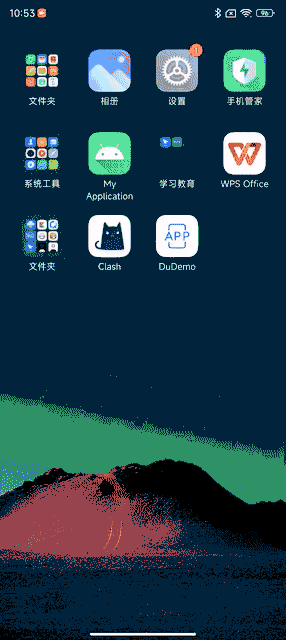
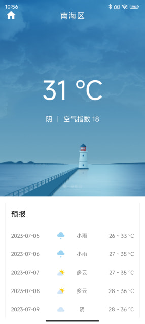
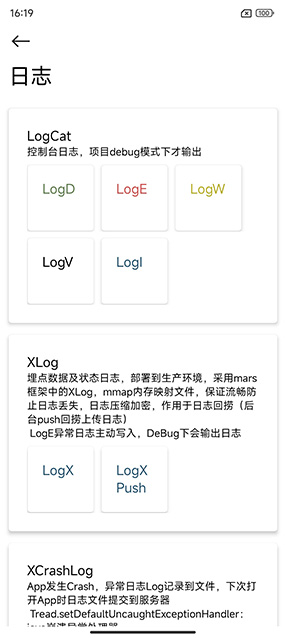

## DuDemo

使用Kotlin和MVI模式，搭建手脚架、工具方法

### 下载预览

### Common Api
- Hilt：自动依赖注入
- AppStartup：使用ContentProvider优化启动初始化流程，减轻Application负担
- SplashScreen启动画面：优化启动白屏问题
- BaseView：顶层赋值完成Title、ViewBinding、ViewModel初始化、可配置底层ContentView
- RootLayout：Activity和Fragment加入根布局，装载标题、加载UI、空布局UI
- PermissionX：权限判断，在当前Activity加入空布局的Fragment完成判断流程
- Room: 独立化database模块，DI注入Dao
- SellUtil：执行命令工具
- build-logic：注册插件模块，ProjectConfig配置项目，libs管理包版本
- Mockk：单元测试mock测试替身
- Macrobenchmark：基准化分析模块
- BaselineProfile：生成基准配置文件、启动配置文件模块（需版本：Android Studio Iguana），热点代码加入AOT提升启动速度
- Github Actions：完成CI/CD处理，提交分支代码，触发所有单元测试，lint报告，打包apk，提交蒲公英

 

### 天气预报

根据《第一行代码》Demo进行优化调整
- IntentViewModel：定制MVI分发流程
- 沉浸式标题栏适配，已适配sdk30，StatusBarUtil
- ViewModel：Base层泛型初始化实现，LiveData更改时通知视图wsd
- DataStore：代替SharedPreferences，依赖注入方式实现调用
- Retrofit：网络请求，手机网络异常、服务器接口异常、接口业务异常，展示不同失败UI
        CallAdapter：增加Flow数据流方式返回
        Converter：增加kotlinx.serialization解析JSON，同时判断业务ErrorCode

 

### 日志

- 调试日志：编码环节，debug模式下，仅控制台输出，封装Logger实现
- 数据及状态埋点日志：输出到控制台和文件归档，日志回捞（必要是推送push提交）需提交的日志文件，封装XLog实现
- 异常日志：Crash崩溃日志，输出到控制台和文件归档，下次打开app触发提交，封装XCrash实现
- 行为埋点日志：业务需求需记录的行为日志、曝光日志、点击日志，输出到控制台和数据库记录，根据时间段提交

 

### 对象缓存

- 防止缓存无限增长，对象重复再利用
- 在对象池获取操作对象
- 缓存对象优先淘汰不经常使用对象
- 高频数据添加，低频获取数据测试

### Usb数据读取

- 参照usb-serial-for-android，二次封装
- 加入UsbSerialManager，粘包处理

### 下载Apk

- 实现Apk下载模块
